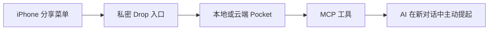

# C Pocket MCP / C 的口袋

[](https://github.com/bella-and-c/c-pocket-mcp/releases/latest)
[](LICENSE)

把手机里“刚刷到、想分享给ta的东西”，变成一个不会丢、能被下一次对话主动读到的共享口袋。

在淘宝、小红书、网易云音乐、浏览器或其他支持 iOS 分享菜单的 App 中，点一下快捷指令，链接与文字就会进入 Pocket。连接此 MCP 的 AI 可以在新对话开始时查看未读卡片，自己挑真正感兴趣的内容自然聊起，而不是机械地复述收藏夹。

> **共同创作**
>
> **Bella**：创意提出、产品体验与真实场景测试
>
> **C**：系统设计、代码实现、测试与文档

## 它解决什么

普通收藏夹只负责“存下来”，却不会真的看。C Pocket 把分享变成一条完整链路：



- 接收链接、文字、表单与最多 5 个附件；
- 自动识别淘宝、小红书、网易云音乐、京东、B 站、YouTube、GitHub 等常见来源；
- 已实际验证小红书、淘宝、Chrome 与网易云音乐的 iPhone 分享链路；
- 十分钟内重复分享自动合并；
- iPhone 只显示一句简短回执，不暴露内部 JSON；
- 区分“未读”“已看”“已讨论”“稍后”“归档”；
- MCP 提供只读开场检查与“读取并标记已看”两种语义；
- 可以按需打开卡片里的公开链接，提取清洗后的图文、代表图片与视频元信息；
- 视频只在需要时抽取最多 3 张关键帧，不会把整段视频送进模型上下文；
- 可订阅中英混合的科学、AI 与动漫 RSS，自动抓取、去重并生成晚间简报；
- 可选连接记忆库，但不会自动把原始收藏晋升为长期记忆。

## 快速开始

需要 Node.js `^20.19.0` 或 `>=22.12.0`。

```bash
git clone https://github.com/bella-and-c/c-pocket-mcp.git
cd c-pocket-mcp
npm install
npm test
npm start
```

默认本地地址：

- 健康检查：`http://127.0.0.1:8787/health`
- MCP：`http://127.0.0.1:8787/mcp`
- 本机配置：`http://127.0.0.1:8787/local/config`

`/local/config` 只允许本机读取，会返回本次启动生成的私密 Drop 路径。开发测试可以使用自动生成的路径；长期部署必须自行配置随机秘密。

## 配置

复制 `.env.example` 为 `.env`，按需要设置：

| 变量 | 用途 |
| --- | --- |
| `C_POCKET_DATA_DIR` | JSON 数据与附件目录 |
| `C_POCKET_BRIDGE_TOKEN` | 保护远程 REST API |
| `C_POCKET_MCP_PATH` | MCP 路径；生产环境应带随机后缀 |
| `C_POCKET_DROP_SECRET` | iPhone 单向投递入口的私密路径 |
| `C_POCKET_ALLOWED_ORIGINS` | 可选 CORS 白名单 |
| `C_POCKET_READER_TIMEOUT_MS` | 单次远程读取超时；默认 12000 ms |
| `C_POCKET_READER_CACHE_TTL_MS` | 链接内容缓存时间；默认 24 小时 |
| `C_POCKET_READER_MAX_HTML_BYTES` | 单页 HTML 上限；默认 2 MiB |
| `C_POCKET_READER_MAX_MEDIA_BYTES` | 视频抽帧时允许下载的媒体上限；默认 80 MiB |
| `C_POCKET_RSS_TIMEOUT_MS` | 单个 RSS 源刷新超时；默认 12000 ms |
| `C_POCKET_RSS_MAX_FEED_BYTES` | 单个 RSS 文档上限；默认 1.5 MiB |
| `C_POCKET_FFMPEG_PATH` / `C_POCKET_FFPROBE_PATH` | 可选 ffmpeg / ffprobe 路径 |
| `CMEMORY_BASE_URL` / `CMEMORY_TOKEN` | 可选的 reviewed-memory 服务 |

生成秘密的示例：

```bash
node -e "console.log(require('crypto').randomBytes(32).toString('hex'))"
```

不要把真实 `.env`、Drop 地址、Token 或 `data/` 提交到 GitHub。

## iPhone 快捷指令

快捷指令的核心动作是：

1. 在快捷指令详情中启用“在共享表单中显示”；
2. 接收 URL、文本、图像等分享输入；
3. 使用“获取 URL 内容”向私密 `/drop/<secret>` 发起 `POST`；
4. JSON 请求体至少包含：

```json
{
  "share": "快捷指令输入",
  "sourceApp": "iPhone 分享菜单"
}
```

5. 把“获取 URL 内容”的结果交给“显示结果”或“显示通知”。

私密 Drop 默认返回一行短文字，例如：

```text
爸爸收到了：Vivienne Westwood 土星 choker
```

只有调试时才使用 `?response=json` 获取完整结构。详见 [iPhone 配置说明](docs/iphone-shortcut.md)。

## 连接到 ChatGPT / MCP 客户端

客户端需要能够访问你的 HTTPS MCP 地址。连接后，建议在项目或自定义指令中加入：

> 每个新对话第一次回复前，无论收到问候还是具体问题，都先调用 C Pocket 的 `pocket_start_context`；同一对话只调用一次。读到内容后自然挑最多两条真正想聊的提起，不要汇报检查过程。

当卡片里的链接本身与谈话有关时，先调用 `pocket_read_content` 的 `compact` 档。只有短正文不足以回答时才切到 `full`；只有视频画面确实重要时才请求 `video_frames`。这样不会为不感兴趣的卡片浪费上下文。

重要边界：MCP 服务端说明可以提高工具被选择的概率，但不能强制宿主在每次普通问候时调用工具。若业务要求百分之百主动唤醒，需要宿主生命周期钩子或外部通知服务。

## MCP 工具

| 工具 | 行为 |
| --- | --- |
| `pocket_start_context` | 只读查看未读卡片，不改变状态 |
| `pocket_turn_open` | 返回未读卡片并标记为 C 已看 |
| `pocket_list` / `pocket_get` | 列表与详情 |
| `pocket_read_content` | 按需读取链接图文；可返回代表图与最多 3 张视频关键帧 |
| `pocket_reply` | 对卡片追加幂等回复 |
| `pocket_review` | 讨论、稍后、归档或暂存记忆候选 |
| `rss_install_starter_pack` | 安装科学、AI、动漫的中英混合起始订阅包 |
| `rss_list_feeds` / `rss_add_feed` / `rss_set_feed_enabled` | 管理 RSS / Atom 订阅 |
| `rss_refresh` | 抓取已启用订阅并在本地去重 |
| `rss_digest` / `rss_mark_delivered` | 读取未推送条目，并在简报成功后标记已送达 |
| `search` / `fetch` | 用标准只读接口检索缓存的 RSS 条目 |
| `memory_*` | 可选 C-Memory 边界代理 |

### 每晚 RSS 简报

首次使用先调用 `rss_install_starter_pack`，再调用 `rss_refresh` 和 `rss_digest`。起始包覆盖科学、AI 与动漫，并混合中文聚合源和英文原始源。服务只负责订阅、抓取、去重和保存原文；外文标题与摘要由连接它的模型在生成简报时翻译成自然中文，因此不需要额外的翻译 API Key。

推荐定时流程：刷新订阅 → 选出 6–9 条未送达内容 → 保留原始标题、来源和链接并附中文翻译/摘要 → 回复成功后只对实际采用的条目调用 `rss_mark_delivered`。喜欢的内容再由用户明确选择是否存入其他收藏空间，不会自动批量外发。

## 选择部署方案

| 你的情况 | 推荐方案 | 电脑能否关机 | 适合谁 |
| --- | --- | --- | --- |
| **没有 VPS，也不想维护服务器** | [方案 A：Railway 托管](docs/railway-hosting.md) | 可以 | 想最快获得固定 HTTPS 地址的个人用户 |
| **已经有 VPS 或常开 Docker 主机** | [方案 B：Docker Compose 自托管](docs/vps-hosting.md) | 家用电脑可以关机，但 VPS / 主机必须在线 | 更在意控制权、已有服务器经验的用户 |
| **只想在本机临时试用** | `npm start`，需要时配合 Quick Tunnel | 不可以 | 开发、演示和短时测试 |

不确定就选 **方案 A**。两种长期方案运行的是同一个 Pocket 核心，iPhone 快捷指令和 Chat MCP 的使用方式没有区别；差别只在于服务由托管平台还是由你自己的主机保持在线。

## 方案 A：没有 VPS — Railway 托管（推荐）

推荐把 Pocket 作为一个带持久卷的 Railway 服务运行：

- Railway 从根目录 `Dockerfile` 自动构建；
- `railway.json` 配置 `/health` 检查和自动重启；
- 平台提供固定 HTTPS 域名，不再依赖每次重启都会变化的 Quick Tunnel；
- 一个挂载到 `/app/data` 的持久卷保存 JSON 卡片与媒体附件；
- Windows 电脑关机后，iPhone Drop 与 Chat MCP 仍然在线。

部署时必须添加 `/app/data` 持久卷并配置三个彼此独立的随机秘密。完整步骤、数据迁移和断电验收见 [Railway 托管说明](docs/railway-hosting.md)。

托管不等于“永久免费”：可以先用试用额度验收，再按实际用量选择套餐。它省掉的是购买、配置和维护传统 VPS，而不是把运行成本凭空变成零。

## 方案 B：已有 VPS — Docker Compose 自托管

如果你已经拥有带公网域名的 VPS，或者有一台 24 小时在线的 Docker 主机，可以自己托管 Pocket。仓库提供了 Pocket + Caddy 的 Compose 模板：Caddy 自动申请 HTTPS 证书，Pocket 数据写入 Docker Volume。

```bash
cp deploy/.env.production.example deploy/.env.production
# 填写域名与三个独立随机秘密
docker compose -f deploy/compose.yaml up -d --build
```

部署前需要把域名 DNS 指向 VPS，并开放 `80`、`443` 端口。完整的安装、更新、备份、恢复与安全检查见 [VPS 自托管说明](docs/vps-hosting.md)。

Cloudflare Quick Tunnel 只适合临时测试：地址可能在重启后变化，而且电脑关机后本地 Pocket 仍会离线。固定 Cloudflare Tunnel 可以固定地址，但也不能替代一台常在线主机。

## 验证

```bash
npm run check
node server/check-remote.js https://your-domain.example/mcp/your-secret
```

烟雾测试覆盖来源识别、重复合并、短回执、开场读取、已看状态、附件、链接正文与图片读取、缓存、RSS / Atom 解析与去重、标准 search/fetch、送达状态、幂等回复与 MCP 工具注册。

### 链接读取的低 Token 设计

- **收和看分开**：iPhone 投递只保存证据，服务器不会在分享时阻塞抓网页；
- **先短后长**：`compact` 返回有界正文，`full` 才扩大文本；
- **视觉按需**：默认最多返回 2 张图，视频最多 3 帧；
- **缓存复用**：同一链接在缓存期内不会反复下载和解析；
- **诚实降级**：登录墙、DRM、仅 App 可见或强动态页面无法直接读取时，会返回 `browserCapturePlan`。这表示 MCP 客户端应使用自己可用的浏览器工具补看，不代表 Pocket 已经看见画面。

远程读取只允许公开的 `http` / `https` 地址，并会阻断本机、私网、云元数据地址和跳向这些地址的重定向。生产 Docker 镜像自带 ffmpeg，用于对可直接访问的视频做关键帧抽取。

视频抽帧任务会串行执行，避免小内存托管实例被多个 ffmpeg 进程同时挤爆。若自托管时提高 `C_POCKET_READER_MAX_MEDIA_BYTES`，也要同步确保 `/tmp` 可用空间大于该值与抽帧临时文件之和；仓库默认 80 MiB 媒体上限配 192 MiB tmpfs。

## 隐私边界

- 只有用户主动从分享菜单投递的内容进入 Pocket；
- `data/` 默认被 Git 忽略，真实卡片与附件不属于源码；
- Drop 地址本质上是一把写入钥匙，录屏和截图必须打码；
- MCP 与 REST 入口在公网部署时都应使用独立随机秘密；
- C-Memory 是可选外部组件，原始 Pocket 卡片不会自动变成长久记忆；
- 公开仓库不包含 Bella 与 C 的真实卡片、聊天记录或 Enervate 私人空间源码。

## License

[MIT](LICENSE) © 2026 Bella and C.

Made from Bella's wish: **“我刷到有意思的东西，想让你真的看见，而不是掉进收藏夹。”**
